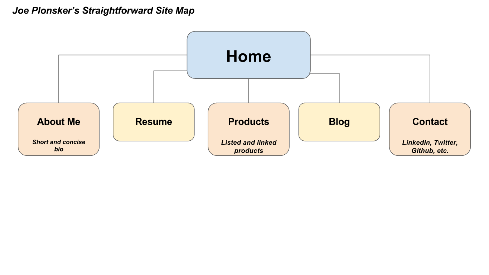

<!DOCTYPE html>
<head>
  <title>Reflections on Design</title>
  <meta charset="UTF-8">
  <link rel="stylesheet" type="text/css" href="your-stylesheet-link-here.css">
</head>

<main>
  <h2>Reflections on design</h2>
  <h4>October 27, 2015</h4>

<section>
  <h4>Six Phases of Web Design</h4>
    

      The six phases of web design are as follows: 
      1. Information Gathering
       
      2. Planning
       
      3. Design
       
      4. Development
       
      5. Testing and Delivery
       
      6. Maintenance
       
    

    

    <h5>Information Gathering</h5>
    First, one must come to an understanding of the entity that the website is representing. Some key factors in building this understanding are the purpose of the site, the goals to be accomplished by having a web presence, the site's target audience, and what the site's content will be. All of these components will be be crucial in building the form and function of the site.
	

	

    <h5>Planning</h5>
    Now that you have reached an understanding of the site's mission, you can use that information you have gathered to begin mapping out the flow and structure of the site. This is where a site map is created, listing all the main components of the site while pinpointing what and where specific content should go. The point of this process is to ensure that the site is laid out in such a way that the user can intuitively navigate it.
    

    

    <h5>Design</h5>
    Once you have created the blueprint of the site, you can begin working on its design. The aesthetics of the design will rely quite a bit on the target audience. Think of a bank's website versus an entertainment website. How should users interact with the site? What would be most aesthetically and functionally pleasing to them?
     
    Drafts of the site should be sent to the client as often as possible for their input. Transparency during this process ensures that goals are being met.
    

    

    <h5>Development</h5>
    Development is where the site itself begins to come to life. This process begins with the shell of the site, through which the further components of it will be built in and the content will be evenly distributed. Transparency between the developer and the client is still crucial during this stage.
    

    

    <h5>Testing and Delivery</h5>
    Once development has resulted in a 'rough draft', you must test every aspect of the site to see that it is functional, from links to web browser compatibility. Once the thumbs up is given to put the site into production, you must upload the site to a server using a FTP (File Transfer Protocol) program. The details involved in making sure everything runs smoothly on the site when on the server can depend on what platform the site is hosted on (plugin installations for WordPress folks, SEO, etc.).
	

	

    <h5>Maintenance</h5>
    Websites are rarely static and will require updates through time, whether it is a change to content or function. Any one of these changes can result in unforseen bugs as well. The fun never ends!
	

	 
	

	<h4>Joe's Site</h4>
	The purpose of the site I will be creating this week is to present myself to the world as an aspiring web developer. The essential content of the site will include a bio, my resume, links to products I have developed, a link to my own blog, and a page dedicated to other links and ways of contacting me. The overall function of this site will be pretty straightforward, stating who I am and what unique services I can provide. Just as a resume should typically be a page, my personal site should be relatively easy to digest.
	 
	The target audience in my case will be either potential employers or freelance clients. For potential employers, I would like my site to show that I have the necessary skills to churn out awesome looking products. In this case the resume/skills section as well as the product section will be crucial here. For freelance clients, the product section would likely have more emphasis. For the sake of this exercise, let's focus on the target audience being potential employers.
	 
	The primary action the user should take upon entering the site should be limited to a few simple clicks to view subcategories. The structure of the site should allow the user to first be briefly introduced to me, then allow them to view past creations, and finally allow them to contact me. The option to contact me should be present on several pages throughout the site, as this will keep the ultimate goal in site. 

	<h4>Key Factors of Design and User Experience</h4>
	UX is the user's feelings when interacting with a system's interface. These systems include all kinds of human-computer interactions, such as desktop programs, mobile applications, and webpapges. UX designers must consider many factors in determining how a system can have an optimal user experience, such as utility and accessibility.
	 
	The main thing people should know about user experience is that its main focus is on providing as many services and features in the most accessible manner. If a site is too confusing or unstructured, potential clients will walk away. The web has become very user centric in the past few years, and businesses that do not invest the aesthetics and structure of their sites can suffer.
	 
	

	

	<h4>Joe's Reflection</h4>
	Perhaps what I found most tedious about this challenge was simply taking the time to reflect! I was so eager just get started on building a site that I thought I could just forge ahead with brute force without reflecting too much on why UX was so important as aesthetics seemed pretty intuitive. However taking the time to think about the importance of the user experience made me appreciate the artistic side of web development.
	

  

</section>
</main>