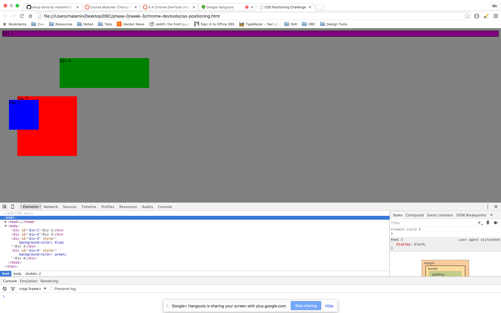
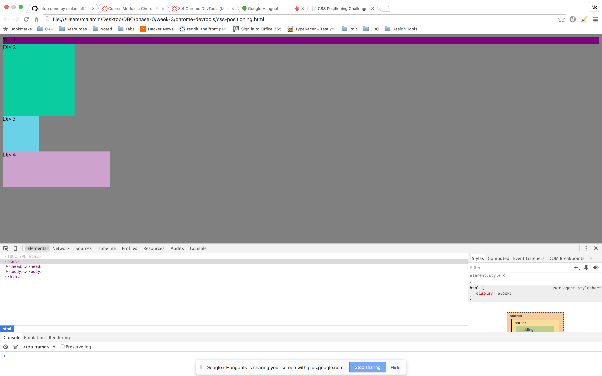
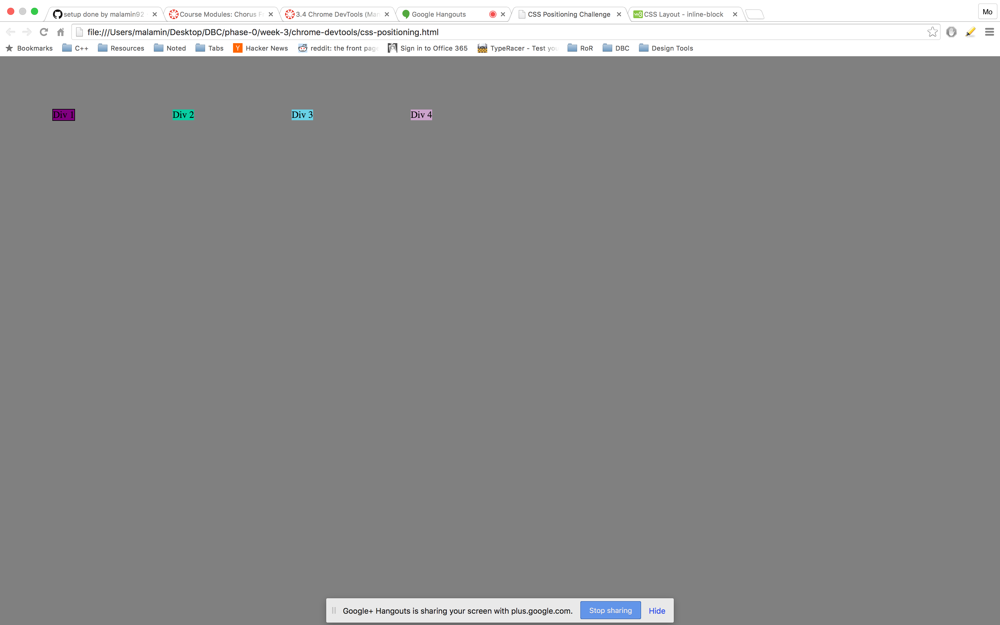
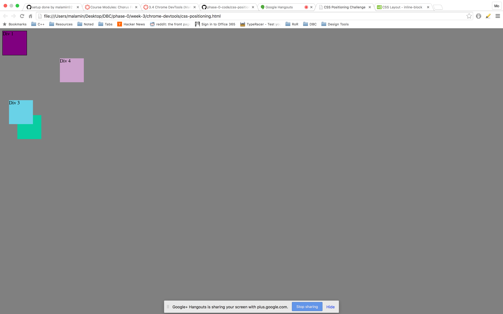
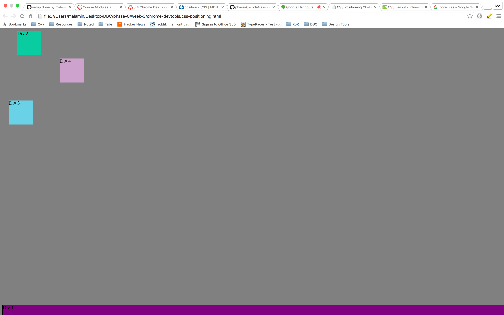
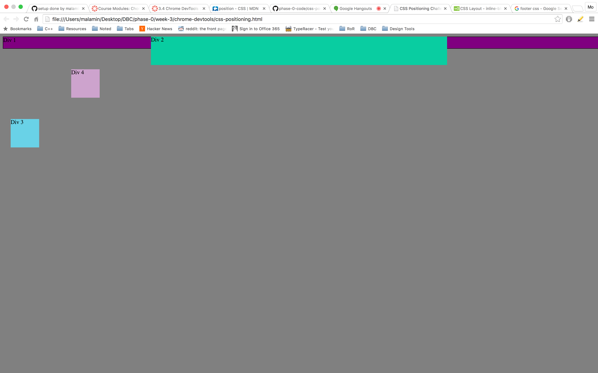
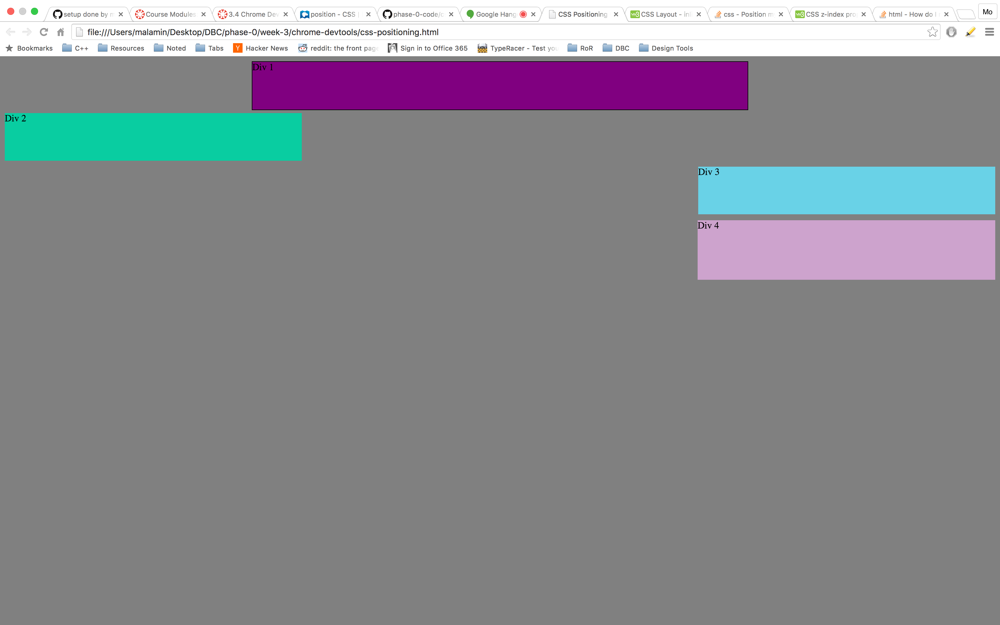
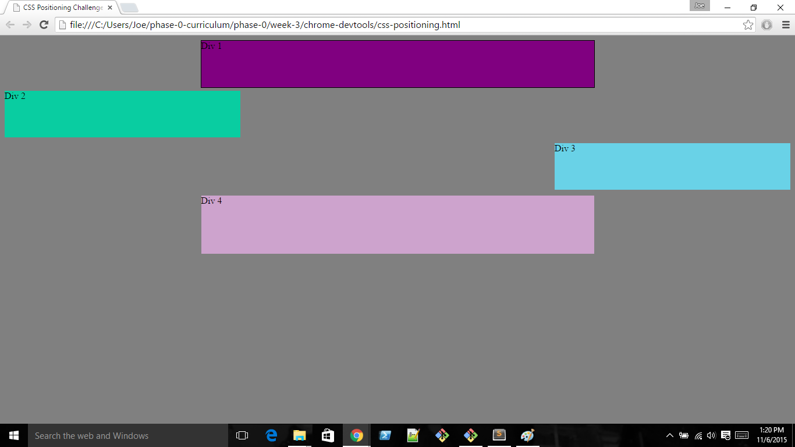

##How can you use Chrome's DevTools inspector to help you format or position elements?
-Chrome's Devtool and element panel allows one to inspect the entire page in both its HTML and CSS components. It was particularly helpful in isolating bits of CSS that conflicted with other elements or were in fact just plain wrong. A couple of times the syntax I dictated was off and the inspector highlighted those issues. Having the big-picture view in an easily collapsible format that I could navigate through and that pinpointed specific conflicts that the naked eye could not catch made working with my pairing peer much more efficient and productive. The fact that we could click on individual elements and see their impact on the page (even their margins) was incredibly helpful. Much better than making incremental changes and flipping back and forth between documents. 

##How can you resize elements on the DOM using CSS?
The answer ties in with comments I made in my previous response. At times we were able to target specific elements and change their orientation directly through the inspector. 

##What are the differences between absolute, fixed, static, and relative positioning? Which did you find easiest to use? Which was most difficult?

Absolute positioning keeps an element exactly where one would want it on the page regardless of browser dimensions.  

Fixed positioning positions an element in context to the browser one is in. The element stays put no matter where one would scroll on the page.

Static is the default positioning for HTML elements, meaning it’s simply positioned as it is according to the flow of the page. There is no special positioning defined for the element.

Relative is a bit trickier. Any changes one would make to an element in terms of its positioning attributes would move that element in relation to what its static positioning would have been. If a change is made to the left of the element, it will move in relation to where it would have originally sat in static positioning.

Fixed positioning was the easiest to use at several points, as it allowed us to send elements to either the top, bottom, or side at the page with ease. Relative was a bit trickier and we kept going down a few rabbit holes while moving some elements around. 

##What are the differences between margin, border, and padding?
What was your impression of this challenge overall? (love, hate, and why?)
Margins are the space around an element between it and everything else. The border is what encloses the element. The padding is the space between the content within the element and its border. 

Overall, I enjoyed this exercise, even when it started to make my brain feel a bit mushy. For the most part, my pairing peer and I ran into only a few issues while moving elements around and had fun bouncing ideas off of each other. However we began running into a couple of issues once we were told to 'get creative'. We absolutely could not get our fourth div to budge anywhere on the page, and the inspector made it seem like something in div 3 was preventing div 4 from moving down the page. We tried many different positions, changed the margins, floated elements around, even tried the z-index feature (which ended up doing nothing for us and was a good lesson in itself), but the div would not move. We decided to go over the alloted time just to satisfy our curiosity, and finally agreed at one point that it would be best to break and see if one of us had an epiphany. Lo and behold, my pairing peer thought of something a couple of hours later: we were so obsessed with div-4's sides that we never made modifications to the top of the element. After making the fix the image looked just as we wanted it. Once again we were reminded that it's always best to take a moment to relax and the solution can come to you at an unexpected time, like Archimedes when he took a bath (context: https://en.wikipedia.org/wiki/Archimedes#Archimedes.27_principle).

##Exercise 1:

##Exercise 2:

##Exercise 3:

##Exercise 4:

##Exercise 5:

##Exercise 6:

##Exercise 7:

##Exercise 8:

##Exercise 9, take 1:

##Exercise 9, take 2 with correct code:

