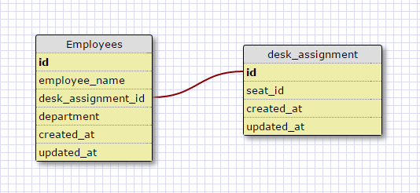
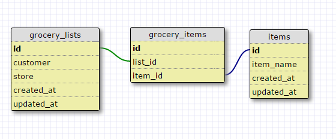

###Explain why this relationship is a one-to-one to the best of your ability. 

This design is a one-to-one relationship because an employee can have only one seating assignment in an office as a location identifier, nor can a single seat be assigned to multiple individuals. 

###Many-to-many

###Reflection

###What is a one-to-one database?
A one-to-one database consists of tables that have a single relationship between one another, meaning that rows from each can only correspond with each other in one way. 

###When would you use a one-to-one database? (Think generally, not in terms of the example you created).
We would use a one-to-one relationship when one row can have a unique relationship to a row in another table. Think of specific identifiers for things such as names, serial numbers, etc. 

###What is a many-to-many database?
A many-to-many database is when you have tables whose rows can have multiple relationships to the rows in another. In these kinds of databases there is a table that mediates the relationship between the two other ones. 

###When would you use a many-to-many database? (Think generally, not in terms of the example you created).
A many-to-many database would be used when we want to keep a dynamic relationship between two tables, meaning multiple assignments between rows can take place.

###What is confusing about database schemas? What makes sense?
It makes sense that some things can only maintain a single relationship between each other while other things can have relationships between each other that are defined in a certain way but have different contents/unique identifiers. What confuses me though is how to navigate those relationships. Perhaps this will become clearer when I start combining the syntax I learned earlier for the command line and what I learned in this lesson. 

